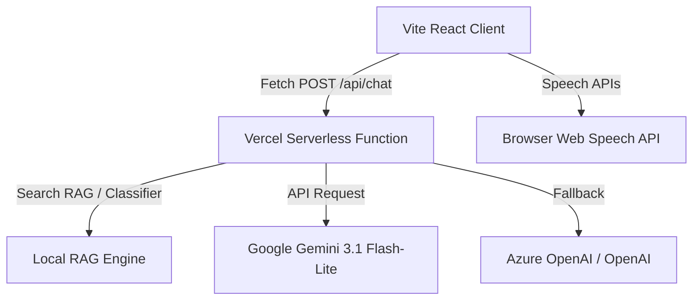

# SUTRA — Stadium Unified Tournament Response Assistant

SUTRA is a unified, GenAI-enabled stadium operations and fan experience platform designed for the FIFA World Cup 2026. It integrates real-time wayfinding navigation, crowd flow management, accessibility accommodations, green transit scheduling, sustainability tracking, and operational incident triage into a single interactive platform.

The system serves three distinct personas: **Fans**, **Staff & Volunteers**, and **Organizers (Control Tower)**, backed by a high-fidelity SVG interactive stadium blueprint, a local RAG database, and a secure server-side GenAI proxy.

---

## 🌟 Key Features & Persona Workspaces

### 1. Fan Companion (Voice Concierge & Wayfinder)
* **AI Voice Assistant**: Supports voice-to-text queries (using the Web Speech Recognition API) and reads out navigation directions (using Speech Synthesis) for accessibility.
* **Smart Wayfinding**: Renders dynamic neon navigation routes on the stadium map (e.g., Gate A to Section 102).
* **Accessibility Mode**: Toggles elevator-only routes, high-contrast markers, and sensory quiet room highlights.
* **Green Commute Logger**: Gamified carbon-offset tracker where fans log public transit commutes to earn the "Green Fan Badge" and plant virtual trees.

### 2. Staff & Volunteers (Incident Workspace)
* **Real-Time Reporter**: Allows volunteers to file incidents (e.g., wet spills, power failures, medical emergencies) directly on the visual stadium map.
* **Active Task Queue**: Lists pending, dispatched, and resolved incidents with immediate dispatch buttons.
* **Volunteer Translator**: Real-time voice translation widget helping volunteers communicate with international fans in Spanish, French, German, and Portuguese.

### 3. Control Tower (Operations Dashboard)
* **Operations Analytics**: Displays live ingress attendance, carbon offsets, and trash recycling data using Area and Bar charts.
* **Predictive AI Radar**: Generates preventative system notifications (e.g., predicting Gate C queue peaks, EV charging overload).
* **Crowd Multiplier Slider**: Interactive control allowing organizers to simulate stadium occupancy rates and monitor real-time flow capacity.

---

## 🗺️ Interactive SVG Stadium Map

The core visual anchor of the dashboard is a custom, responsive vector blueprint:
* **Interactive Seating Sectors**: Hovering over stadium bowl sections triggers a scale animation and neon outline glow.
* **Live Heatmap**: Sector colors pulse dynamically (Green ➡️ Yellow ➡️ Red) based on live simulated sensor data and crowd capacity.
* **Double-Pulse Incident Pins**: Active emergencies pulse on the map with double concentric hazard rings, fading out dynamically when resolved.
* **Dynamic Neon Paths**: Guided routes render as dual-layer paths (glowing background backer + animated dashes offset infinitely).

---

## ⚙️ Architecture & Build Details



### 1. Frontend System
* **Framework**: React 19 + TypeScript + Vite.
* **Styling**: Vanilla CSS glassmorphic variables (`backdrop-filter: blur(20px)`), floating ambient backdrop blurs, and midnight neon color tokens.
* **Animations**: Framer Motion transitions, spring-physics sliding tab indicators, and custom SVG CSS keyframes.

### 2. Backend Serverless Gateway
* **Hosting**: Vercel Serverless Functions (`api/chat/index.js`).
* **Protocol**: ES Modules (`export default async function handler`) built to match the root `"type": "module"` configuration.
* **Secure API Call Hierarchy**:
  1. Detects and validates API keys securely from Vercel environment variables (preventing client-side exposures).
  2. Prioritizes **Google Gemini** (`gemini-3.1-flash-lite` ➡️ `gemini-3.5-flash` fallback loop).
  3. Falls back to **Azure OpenAI** or **Standard OpenAI** if credentials are set.
  4. Returns a simulated proxy diagnostics report if no API keys are configured.

---

## ⚡ Performance, QA & Security Optimizations

### 1. Rollup Code Splitting (Zero 500kB Warnings)
Third-party libraries are compiled into individual vendor chunks to optimize loading speeds and eliminate browser blocking:
- `index.html`: **1.52 kB**
- `index.css` (Glass theme variables): **7.07 kB**
- `index.js` (App logic): **81.79 kB** (Very lightweight!)
- `vendor-core.js` (React & DOM): **272.23 kB**
- `vendor-charts.js` (Recharts & D3): **381.21 kB**
- `vendor-motion.js` (Framer Motion): **32.55 kB**
- `vendor-icons.js` (Lucide Icons): **8.26 kB**

### 2. Advanced Security Posture
* **CORS Whitelisting**: Restricted backend `Access-Control-Allow-Origin` headers to accept requests exclusively from local environments (`localhost`) and verified subdomains (`*.vercel.app`, `*.azurestaticapps.net`).
* **Input Sanitization**: Rejects arbitrary string parameters for critical fields like `persona` to block system-prompt injection attacks.
* **URL Parameter Hiding**: Shifted the Gemini key from URL query variables to custom server-side `x-goog-api-key` headers.

### 3. QA Testing Harness
* **Vitest Coverage**: Complete testing files for all components checking render conditions, empty states, and RAG database retrieval.
* **Telemetry Diagnostics**: An in-app **🧪 Test Console** that allows judges to run an automated suite of system integration assertions directly inside the browser viewport.

---

## 🛠️ Local Development & Execution

### Prerequisites
- Node.js (v18 or higher recommended)
- npm (v9 or higher)

### Setup & Installation
1. Clone the repository and install dependencies:
   ```bash
   npm install
   ```

2. Run the local development server:
   ```bash
   npm run dev
   ```

3. Execute the Vitest suite:
   ```bash
   npm run test
   ```

4. Build the application for production:
   ```bash
   npm run build
   ```

5. Preview the production build locally:
   ```bash
   npm run preview
   ```

### Serverless Environment Settings
Configure these environment variables in your Vercel Dashboard or local `.env` configuration file:
```env
GEMINI_API_KEY=your_gemini_api_key_here
GEMINI_MODEL=gemini-3.1-flash-lite
AZURE_OPENAI_KEY=optional_azure_key
AZURE_OPENAI_ENDPOINT=optional_azure_endpoint
OPENAI_API_KEY=optional_openai_key
```
